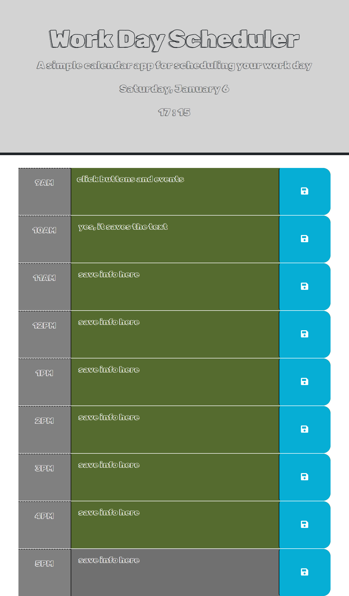

This application was made to allow a user to schedule their tasks and events on a 9 to 5 basis simply and effectively. When inputting information into the corresponding event box, the save button will store the information for the user to remember later.

All coding in this project was done by myself with the use of class resources, starter code provided for this project through the bootcamp, my own knowledge, and the class teacher ai chat assistant. There are no assets in this to be credited.

Here I have attached a screenshot of the layout of my application (as taken during 5pm):

A link to the deployed application:
https://msteven5.github.io/Day-Planner-Application/

Enjoy! Thank you for visiting my website!